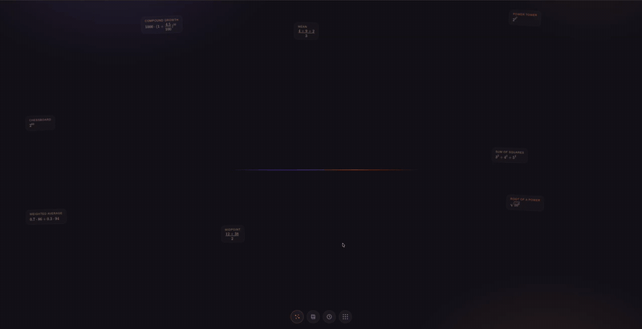

<div align="center">

# Sezzle Calculator

**A full-stack calculator that shows its work.**

Visual math editing on top of a strict Go expression engine — with guided,
step-by-step explanations and diagrams that redraw as you edit the digits.

*Go · React 19 · TypeScript · MathLive · zustand*

**Live demo: [calculator.aliboyev.com](https://calculator.aliboyev.com)**



*Two-minute demo at 3× speed — [full-quality video](https://github.com/aaliboyev/sezzle-calculator/releases/download/v1.0.0/demo.mp4)*

</div>

## Features

- **Visual math input** — a MathLive `<math-field>` with LaTeX underneath. Plain typing feels like a text input; typing `sqrt` becomes a real radical, `/` builds a fraction, and pasted LaTeX renders instantly.
- **Guided formulas** — 37 recognized patterns (pythagoras, compound growth, discriminant, e-by-compounding, …) explain themselves with worked steps computed from your actual digits. Edit a number and the steps follow; 17 patterns draw reactive SVG diagrams — the triangle re-scales, the parabola's roots follow the discriminant's sign.
- **Formula library** — ~40 formulas in seven color-coded categories (geometry, money, statistics, roots & powers, curiosities, science, edge cases), one click from browsing to computing.
- **Living example cards** — a seeded random sample drifts slowly around the free space; the scatter button deals a fresh hand in fresh positions.
- **History** — every successful `=` is stored locally, deduped by an 8-char hash of the formula, capped at 50; selecting an entry re-inputs its LaTeX.
- **Honest math** — the backend evaluates with real float64 semantics: division by zero, `0/0`, `√-9`, and overflow return specific structured errors instead of invented numbers; `0.1+0.2` returns the honest float and the display rounds the noise.
- **One binary** — the production build embeds the frontend into the Go binary; the Docker image is distroless and runs as nonroot with a strict CSP.

## Supported math

`+ − × ÷` with standard precedence · parentheses · unary minus · `^` (right-associative) · postfix `%` (`18% = 0.18`) · `√` / `sqrt` (parens optional) · decimal and exponent literals (`1e-7`)

## Quick start

Requires **Go 1.25+** and **Node 22+**.

```sh
make run
```

That single command creates `.env` from the example, installs frontend
dependencies, builds the UI, embeds it into the Go binary, and starts it:

```
listening on http://localhost:5700 (api: http://localhost:5700/api/v1/calculate)
```

Open **http://localhost:5700** — that's the whole app.

Or with Docker:

```sh
docker build -t calculator .
docker run -p 5700:5700 calculator
```

## Development

Two processes, hot reload on both sides (`.env` and `npm ci` happen automatically):

```sh
make dev-backend     # Go API on :5700
make dev-frontend    # Vite on :5701, proxies /api to the backend
```

Open http://localhost:5701 for the dev UI.

## Tests

```sh
make test        # Go + Vitest unit tests (edge cases are first-class)
make e2e         # Playwright flows against the real backend + Vite
make coverage    # coverage reports for both layers
```

## API

`POST /api/v1/calculate` evaluates an expression; `GET /health` is liveness.

```sh
curl -s localhost:5700/api/v1/calculate -d '{"expression": "(2+3)*4"}'
# {"result":20}

curl -s localhost:5700/api/v1/calculate -d '{"expression": "√9+50%"}'
# {"result":3.5}

curl -s localhost:5700/api/v1/calculate -d '{"expression": "1/0"}'
# {"error":{"code":"division_by_zero","message":"division by zero"}}  (HTTP 422)

curl -s localhost:5700/api/v1/calculate -d '{"expression": 5}'
# {"error":{"code":"invalid_request","message":"\"expression\" must be a string"}}  (HTTP 400)
```

Error codes: `invalid_request` (400, malformed body), `invalid_expression`, `division_by_zero`, `overflow`, `undefined_result` (422, valid request that cannot be computed), `method_not_allowed` (405).

## Design notes

- **Expression string over `{op, operands}`.** The API takes `{"expression": "..."}` and the backend tokenizes, converts to RPN (shunting-yard), and evaluates. This keeps all arithmetic semantics — precedence, associativity, div-by-zero, overflow — in one tested place, and the frontend stays a thin input surface.
- **Errors are structured and terminal.** Every failure maps to a `{error: {code, message}}` body with a specific status; JSON cannot carry `Inf`/`NaN`, so overflow and indeterminate results are 422 errors rather than sentinel values.
- **The input is a MathLive `<math-field>`** — visual math editing with LaTeX underneath. MathLive owns cursor navigation and formula structure; the app's keypad inserts into the field.
- **A whitelisted translation engine** (`src/engine/translate.ts`) turns field content into the backend grammar: LaTeX → MathJSON (`@cortex-js/compute-engine`, `canonical: false` so structure is preserved, not computed) → a tree walk that emits exactly what `expr.go` accepts. Anything outside the whitelist surfaces as "unsupported: X" in the UI and never produces a malformed request. The server stays notation-agnostic.
- **Guided mode matches MathJSON templates with number slots** (`src/engine/guides/`): digits stay editable while structure holds; breaking the structure pauses the guide after a 1s debounce instead of flashing it away. Diagrams are either declarative shape specs rendered by one component or bespoke components under a shared contract; deliberately generic shapes (a bare `a·b` or `a/b`) are left unguided rather than mislabeled.
- **A formula catalog drives discovery** (`src/engine/formulas.ts`); every entry is machine-checked against the translator in unit tests.
- **History is local and content-addressed** — `{hash, latex, result}` in localStorage via zustand's persist middleware, deduped by an 8-char FNV-1a hash.
- **State lives in a zustand store, not components.** Components are presentational and subscribe only to the slice they render — pressing `=` re-renders the result, not the keypad. Frontend logic lives in pure modules (`src/engine`, `src/lib`, `src/store`), unit-tested under node; components and DOM wiring are proven end-to-end by Playwright against the real stack.
- **Single-binary deploy.** `go build -tags embed` serves the built frontend from the Go binary; dev builds skip the embed and Vite proxies `/api`. The server sets `nosniff`, a same-origin CSP (inline styles and `data:` fonts allowed — MathLive requires both), and `Referrer-Policy`; directory listings are suppressed; the Docker image runs as nonroot.
