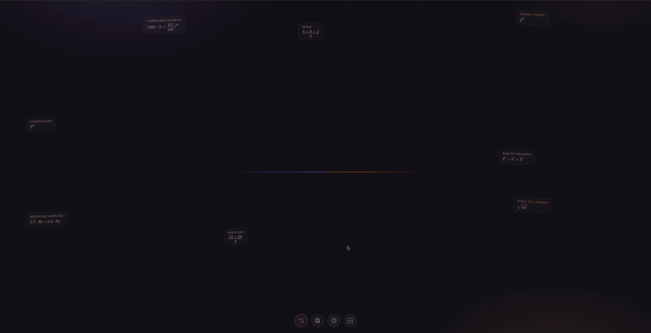

<div align="center">

# Sezzle Calculator

**A full-stack calculator that shows its work.**

Visual math editing on top of a strict Go expression engine — with guided,
step-by-step explanations and diagrams that redraw as you edit the digits.

*Go · React 19 · TypeScript · MathLive · zustand*

**Live demo: [calculator.aliboyev.com](https://calculator.aliboyev.com)**



*Two-minute demo at 3× speed — [full-quality video](https://github.com/aaliboyev/sezzle-calculator/releases/download/v1.0.0/demo.mp4)*

</div>

## Features

- **Visual math input** — a MathLive `<math-field>` with LaTeX underneath. Plain typing feels like a text input; typing `sqrt` becomes a real radical, `/` builds a fraction, and pasted LaTeX renders instantly.
- **Guided formulas** — 37 recognized patterns (pythagoras, compound growth, discriminant, e-by-compounding, …) explain themselves with worked steps computed from your actual digits. Edit a number and the steps follow; 17 patterns draw reactive SVG diagrams — the triangle re-scales, the parabola's roots follow the discriminant's sign.
- **Formula library** — ~40 formulas in seven color-coded categories (geometry, money, statistics, roots & powers, curiosities, science, edge cases), one click from browsing to computing.
- **Living example cards** — a seeded random sample drifts slowly around the free space; the scatter button deals a fresh hand in fresh positions.
- **Live preview** — the result appears faintly under the field while you type; `=` commits it.
- **History** — every successful `=` is stored locally, deduped by an 8-char hash of the formula, capped at 50 unpinned entries. Selecting an entry re-inputs its LaTeX; pinned entries stay on top and survive clearing. The `ans` key and each entry's insert button reuse earlier values.
- **Search** — `⌘K` / `Ctrl+K` filters the formula library and history in one list.
- **Share links** — the committed expression lives in the URL (`#e=…`); opening a link restores the formula and its guide. Results have copy-value and copy-link buttons.
- **Honest math** — the backend evaluates with real float64 semantics: division by zero, `0/0`, `√-9`, and overflow return specific structured errors instead of invented numbers; `0.1+0.2` returns the honest float and the display rounds the noise.
- **One binary** — the production build embeds the frontend into the Go binary; the Docker image is distroless and runs as nonroot with a strict CSP.

## Supported math

`+ − × ÷` with standard precedence · parentheses · unary minus · implicit products (`2(3+1)`, `2\sqrt{4}`) · powers · percent on numbers (`18\% = 0.18`) · square and nth roots (`\sqrt[3]{-8} = -2`) · decimal, exponent, and `7\times10^{-9}` literals

## Quick start

Requires **Go 1.25+** and **Node 22+**.

```sh
make run
```

That single command creates `.env` from the example, installs frontend
dependencies, builds the UI, embeds it into the Go binary, and starts it:

```
listening on http://localhost:5700 (api: http://localhost:5700/api/v1/calculate)
```

Open **http://localhost:5700** — that's the whole app.

Or with Docker:

```sh
docker build -t calculator .
docker run -p 5700:5700 calculator
```

## Development

Two processes, hot reload on both sides (`.env` and `npm ci` happen automatically):

```sh
make dev-backend     # Go API on :5700
make dev-frontend    # Vite on :5701, proxies /api to the backend
```

Open http://localhost:5701 for the dev UI.

## Tests

```sh
make test        # Go + Vitest unit tests (edge cases are first-class)
make e2e         # Playwright flows against the real backend + Vite
make coverage    # coverage reports for both layers
```

## API

`POST /api/v1/evaluate` takes LaTeX and returns the result with its parse tree; `GET /health` is liveness. Plain ASCII arithmetic is valid input too.

```sh
curl -s localhost:5700/api/v1/evaluate -d '{"latex": "(2+3)*4"}'
# {"result":20,"tree":["Multiply",["Add",2,3],4]}

curl -s localhost:5700/api/v1/evaluate -d '{"latex": "\\sqrt{9}+50\\%"}'
# {"result":3.5,"tree":["Add",["Sqrt",9],0.5]}

curl -s localhost:5700/api/v1/evaluate -d '{"latex": "\\frac{1}{0}"}'
# {"tree":["Divide",1,0],"error":{"code":"division_by_zero","message":"division by zero"}}  (HTTP 422)

curl -s localhost:5700/api/v1/evaluate -d '{"latex": "x+1"}'
# {"error":{"code":"unsupported","message":"unsupported: x"}}  (HTTP 422)
```

Error codes: `invalid_request` (400, malformed body), `invalid_expression`, `unsupported`, `division_by_zero`, `overflow`, `undefined_result` (422, valid request that cannot be computed), `method_not_allowed` (405). The tree comes back whenever the LaTeX parsed, including with evaluation errors.

## Design notes

- **The server owns the math.** It parses the math-field's LaTeX directly (`backend/latex.go`, a recursive-descent parser for the arithmetic subset) and evaluates the tree, so precedence, percent, roots, and every error case live in one tested place. Anything outside the subset is a 422 naming the symbol (`unsupported: x`).
- **The tree is MathJSON-shaped and returned to the client.** Guides match their templates against it. Its grouping mirrors the math-field's own parser, and `frontend/src/engine/latex-trees.json` holds reference trees that both the Go and the TypeScript tests check against.
- **Errors are structured and terminal.** Every failure maps to a `{error: {code, message}}` body with a specific status; JSON cannot carry `Inf`/`NaN`, so overflow and indeterminate results are 422 errors rather than sentinel values.
- **The input is a MathLive `<math-field>`** — visual math editing with LaTeX underneath. MathLive owns cursor navigation and formula structure; the app's keypad inserts into the field.
- **Guided mode matches MathJSON templates with number slots** (`src/engine/guides/`): digits stay editable while structure holds; breaking the structure pauses the guide after a 1s debounce instead of flashing it away. Diagrams are components keyed by guide id, so the server never sends drawing data; deliberately generic shapes (a bare `a·b` or `a/b`) are left unguided rather than mislabeled.
- **A formula catalog drives discovery** (`src/engine/formulas.ts`); every entry must have a reference tree, so the Go parser is checked against all of them.
- **History is local and content-addressed** — `{hash, latex, value, pinned}` in localStorage via zustand's persist middleware, deduped by an 8-char FNV-1a hash.
- **State lives in zustand stores, not components.** Components are presentational and subscribe only to the slice they render — pressing `=` re-renders the result, not the keypad. Frontend logic lives in pure modules (`src/engine`, `src/lib`, `src/store`), unit-tested under node; components and DOM wiring are proven end-to-end by Playwright against the real stack.
- **Single-binary deploy.** `go build -tags embed` serves the built frontend from the Go binary; dev builds skip the embed and Vite proxies `/api`. The server sets `nosniff`, a same-origin CSP (inline styles and `data:` fonts allowed — MathLive requires both), and `Referrer-Policy`; directory listings are suppressed; the Docker image runs as nonroot.
